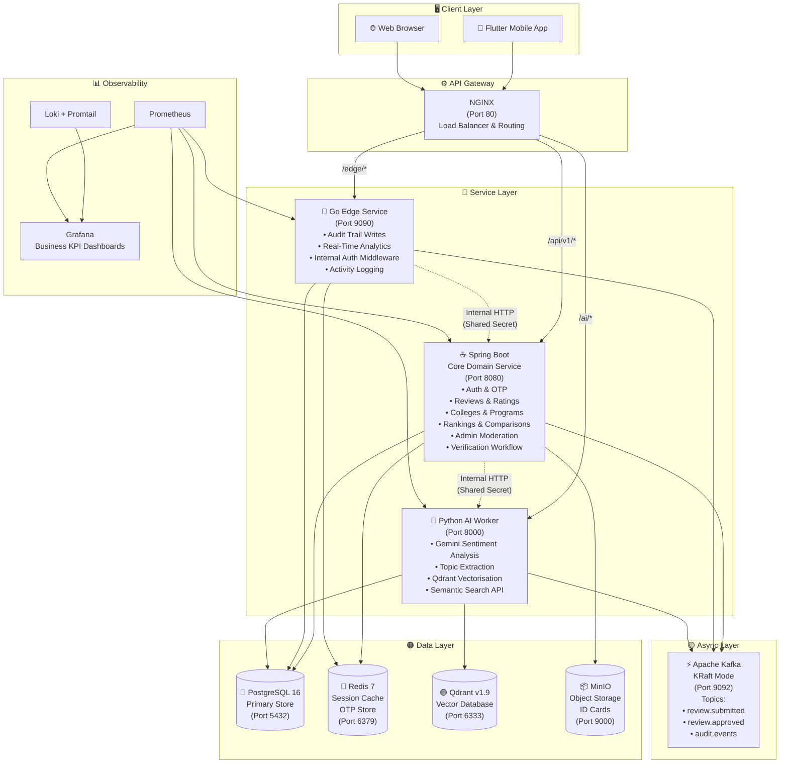
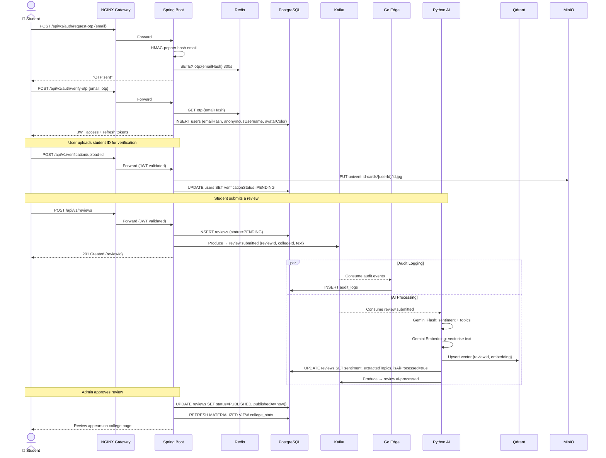
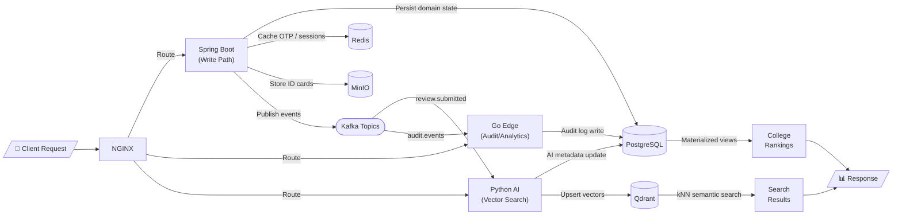
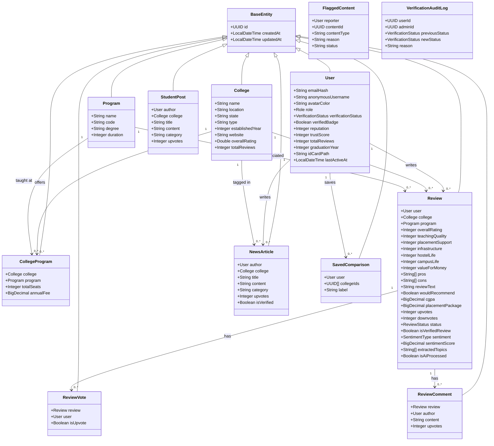
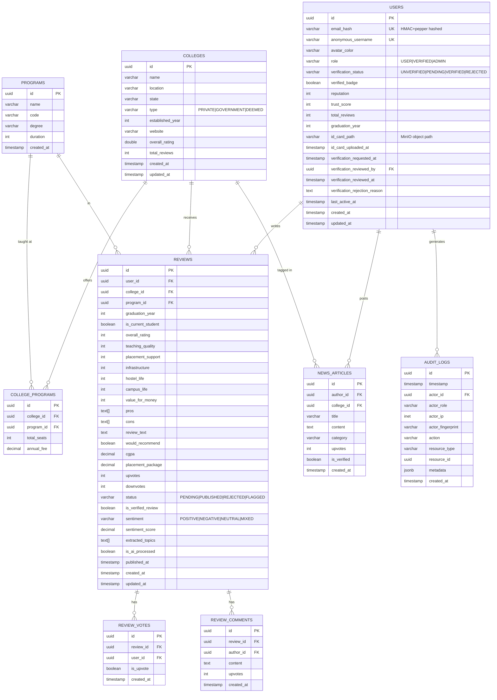
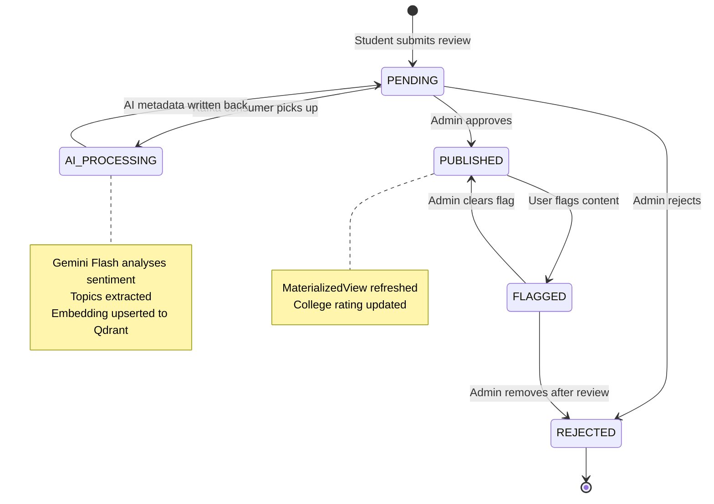
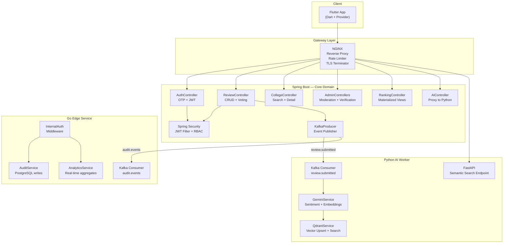
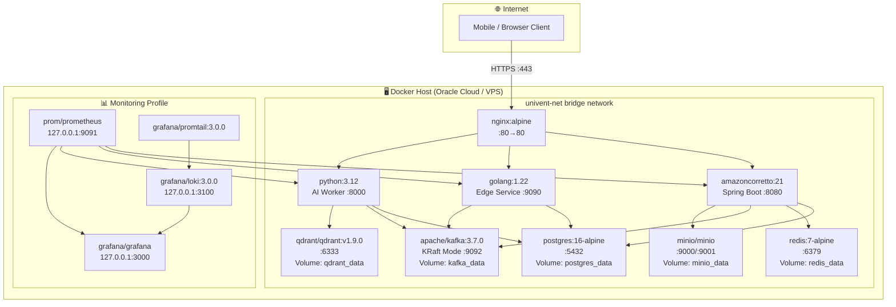
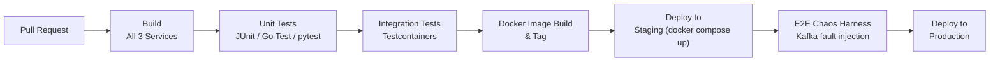

# 🎓 Univent - College Review Platform

> **Empowering students with anonymous, AI-verified insights before the biggest decision of their academic lives.**


---

## 📊 Executive Summary

### 🔴 The Problem
Indian college admissions are plagued by unreliable, paid-for reviews scattered across forums with zero accountability. Students have no verified, structured way to compare colleges on what actually matters — teaching quality, placement support, campus life, or hostel conditions — before making a life-defining choice.

### 🟢 The Solution
Univent is a **polyglot microservices platform** where only verified students can submit reviews. Identity is verified via student ID card upload (stored in MinIO), email is hashed for privacy, and users operate under a randomised anonymous username. Every review is then processed asynchronously by a **Google Gemini-powered AI worker** for sentiment analysis, topic extraction, and semantic search vectorisation into Qdrant. Admins review moderation queues while the Go Edge Service handles audit trails and real-time analytics writes — all without touching the core Spring Boot domain logic.

### ⭐ Key Differentiators
| Feature | How Univent Does It |
|---|---|
| **Privacy-First Identity** | Email hashed + pepper, anonymous username, avatar color — zero PII exposed |
| **Verified Reviews** | Student ID card upload → admin approval workflow before reviews gain `VERIFIED` badge |
| **AI-Augmented Trust** | Gemini extracts sentiment, topics, and embeddings; Qdrant enables semantic search across colleges |
| **Polyglot Architecture** | Spring Boot (domain), Go (edge/audit), Python (AI) — right language for each problem |
| **Full Observability** | Prometheus + Grafana + Loki + Promtail — business KPI dashboards out of the box |

### 🔑 Key Features
- 🔐 **OTP-based email registration** with HMAC-peppered email hashing
- ✅ **Student ID verification** workflow with MinIO secure storage
- ⭐ **Multi-dimensional college reviews** (7 rating axes: Teaching, Placement, Infrastructure, Hostel Life, Campus Life, Value for Money, Overall)
- 🤖 **AI sentiment & topic analysis** via Gemini 2.0 Flash / 2.5 Pro
- 🔍 **Semantic college search** powered by Qdrant vector DB
- 📊 **College rankings & comparisons** with materialized view aggregation
- 📰 **Student news feed** with upvote system
- 🛡️ **Admin moderation panel** for review approval, flag management, and ID verification
- 📈 **Production observability** with Grafana business KPI dashboards

---

## 🏗️ System Architecture

### 3.1 High-Level Architecture Diagram



### 3.2 Architecture Decision Records (ADR)

#### 🗄️ PostgreSQL — Why Not MongoDB?
Univent's data is **highly relational**: Users → Reviews → Colleges → Programs → Votes → Comments. PostgreSQL's foreign key integrity, `TEXT[]` array columns for pros/cons, and native support for `pg_vector` extensions gave us ACID guarantees and the flexibility of semi-structured fields without surrendering relational integrity. Materialized views power the college rankings aggregation, refreshed on demand.

#### ⚡ Kafka (KRaft Mode) — Why Not RabbitMQ?
Review processing is an **event-driven, fan-out workload**: when a review is submitted, both the audit logger (Go) and the AI processor (Python) need to react independently. Kafka's log-based model provides durability, consumer group isolation, and replay capability. KRaft mode eliminates the Zookeeper dependency, making single-node Dev/Prod topology identical.

#### 🐍 Python AI Worker — Why a Separate Service?
Embedding generation, Gemini API calls, and Qdrant upserts are **compute-intensive and latency-tolerant** tasks that must not block a user's review submission. Python owns the best SDK ecosystem for `google-generativeai` and `qdrant-client`. Decoupling it lets us scale the AI service independently (e.g., GPU-attached VM) without touching Spring Boot.

#### 🔵 Go Edge Service — Why a Third Language?
Go's goroutine model and near-zero memory footprint make it ideal for **high-throughput, I/O-bound write operations**: audit trail ingestion and real-time analytics writes that hit PostgreSQL at high frequency. The Go service processes Kafka audit events and exposes internal admin APIs under strict `X-Internal-Secret` authentication, keeping this data pathway off the main domain service.

#### 📱 Flutter Mobile — Why Not React Native?
Flutter's single codebase targeting iOS and Android with a compiled widget engine delivers **smooth 60fps UIs** without a JavaScript bridge. The Provider state management pattern aligns with clean architecture (Repositories → Services → Notifiers → Widgets).

#### 🛡️ JWT + Redis for Session Management
Access tokens (15 min TTL) are stateless JWTs validated by the Spring Security filter on every request. Refresh tokens (7 days) are stored in Redis with the ability to instantly revoke sessions — critical for a platform where users may be banned after identity fraud.

### 3.3 Security Architecture

| Layer | Mechanism |
|---|---|
| **Authentication** | OTP-based email flow → JWT (access 15 min, refresh 7 days) |
| **Authorization** | Spring Security RBAC: `USER`, `VERIFIED`, `ADMIN` roles |
| **Email Privacy** | HMAC-SHA256 hash with server-side pepper — email never stored in plain text |
| **ID Storage** | MinIO presigned URLs; path stored in DB, not raw file |
| **Inter-service Auth** | `X-Internal-Secret` shared-secret header validated by Go middleware |
| **Encryption at Rest** | AES encryption via `ENCRYPTION_SECRET` env variable |
| **Transport Security** | HTTPS via NGINX TLS termination in production |
| **CORS** | Allowlist-based origins (`ALLOWED_ORIGINS` env var) |
| **Rate Limiting** | NGINX upstream rate limiting + Spring Boot request guards |
| **Input Validation** | Bean Validation (Jakarta) on all DTOs; Pydantic models in Python AI worker |

---

## 🔄 Data Flow & Workflow

### 4.1 User Journey — Review Submission & AI Processing



### 4.2 Step-by-Step Workflow Explanation

1. **OTP Request** — Student provides email; Spring Boot hashes it with HMAC+pepper and stores a time-limited OTP in Redis (5-minute TTL).
2. **OTP Verification & Registration** — On valid OTP, a new `User` row is created with the email hash, a randomly generated anonymous username, and assigned avatar colour. JWT pair is issued.
3. **ID Verification** — Student uploads their college ID card; Spring Boot streams it to MinIO's `univent-id-cards` bucket. The metadata path is saved in PostgreSQL; an admin sees this in the verification queue.
4. **Review Submission** — Authenticated student submits a 7-axis review. Spring Boot persists it with `status=PENDING` and immediately publishes a `review.submitted` event to Kafka — returning 201 to the student within milliseconds.
5. **Async AI Processing** — The Python AI Worker consumes the Kafka event, calls Gemini Flash for sentiment classification and topic extraction, generates a text embedding, upserts the vector into Qdrant, and writes AI metadata back to PostgreSQL. The review is now semantically searchable.
6. **Audit Trail** — The Go Edge Service simultaneously consumes `audit.events` from Kafka and persists structured audit logs to PostgreSQL's `audit_logs` table without impacting the Spring Boot service.
7. **Admin Approval** — Admin reviews the enriched review (including AI sentiment) via the moderation panel, approves it (`PUBLISHED`), triggering a materialized view refresh for live college rankings.
8. **Discovery** — Students browse college rankings (materialized views), compare colleges side-by-side, and perform semantic search powered by Qdrant embeddings.

### 4.3 Data Flow Diagram



---

## 📐 UML Diagrams

### 5.1 Class Diagram — Core Domain Model



### 5.2 Database Schema (ER Diagram)



**Schema Design Decisions:**
- **3NF Normalization** — Colleges and Programs are separate tables with a join table (`college_programs`) allowing a program to appear at multiple colleges with per-college fee/seat data.
- **Email Privacy via Hashing** — The `email_hash` column stores an HMAC-SHA256 digest: plain emails are never persisted, preventing PII leakage in DB dumps.
- **PostgreSQL Arrays for Pros/Cons** — `TEXT[]` columns avoid a separate `review_tags` table while retaining indexability via GIN indexes.
- **Audit Logs in JSONB** — Metadata is semi-structured (different payload shapes per action type); JSONB allows querying without schema migration.
- **Materialized Views for Rankings** — `college_stats` materialized view pre-aggregates average ratings per dimension. Refreshed on admin approval — eliminates costly GROUP BY on hot read paths.

### 5.3 Review State Diagram



### 5.4 Component Diagram



### 5.5 Deployment Diagram



---

## 🧩 Design Patterns & Principles

### Architectural Patterns

| Pattern | Where Used | Why |
|---|---|---|
| **Microservices** | Three independent services (Spring Boot, Go, Python) | Independent deploy, scale, and failure domains |
| **Event-Driven Architecture** | Kafka `review.submitted`, `audit.events` | Decouple review write path from AI processing and audit trail |
| **CQRS-lite** | Materialized views for read, direct writes via Spring Data JPA | Separate read-optimised model (college rankings) from write model |
| **API Gateway** | NGINX routes by path prefix | Single entry point, TLS termination, rate limiting without touching services |

### Design Patterns

| Pattern | Implementation |
|---|---|
| **Repository Pattern** | Spring Data JPA repositories (`ReviewRepository`, `CollegeRepository`) abstract all DB queries |
| **Service Layer Pattern** | Dedicated service classes (`ReviewService`, `VerificationService`) own business logic, controllers are thin |
| **Dependency Injection** | Spring IoC container manages all beans; Go services accept dependencies via constructor injection |
| **Observer / Event Listener** | `@KafkaListener` in Python and Go — react to events without coupling to the publisher |
| **Strategy Pattern** | `SentimentType` enum-driven logic in AI worker; different Gemini model selected (Flash vs Pro) based on task complexity |
| **Factory Pattern** | DTOs created via static factory methods to encapsulate entity-to-DTO mapping |

### SOLID Principles

- **S — Single Responsibility**: `VerificationController` only manages ID submission workflows; ranking logic lives entirely in `RankingController` + `MaterializedViewService`.
- **O — Open/Closed**: Adding a new review rating dimension (e.g., `libraryAccess`) requires only a new column + DTO field — no business logic changes.
- **L — Liskov Substitution**: All JPA entities extend `BaseEntity` — any service accepting a `BaseEntity` works with any subtype.
- **I — Interface Segregation**: Spring Data repositories extend only the interfaces needed (`JpaRepository` vs `CrudRepository`).
- **D — Dependency Inversion**: Controllers depend on service interfaces; concrete implementations are injected by Spring at runtime.

---

## 🚀 Getting Started

### Prerequisites

| Tool | Version |
|---|---|
| Docker Desktop | ≥ 24.0 |
| Docker Compose | ≥ 2.20 |
| Java (for local dev) | 21 |
| Go (for local dev) | 1.22 |
| Python (for local dev) | 3.12 |
| Flutter (for mobile) | 3.x |

### Quick Start with Docker Compose

```bash
# 1. Clone the repository
git clone https://github.com/yourusername/Univent.git
cd Univent/infrastructure

# 2. Configure environment
cp .env.example .env
# Edit .env and fill in:
#   POSTGRES_PASSWORD, JWT_SECRET, REDIS_PASSWORD,
#   GEMINI_API_KEY, MINIO_ROOT_USER, MINIO_ROOT_PASSWORD,
#   MAIL_USERNAME, MAIL_PASSWORD, INTERNAL_SHARED_SECRET,
#   ENCRYPTION_SECRET, APP_EMAIL_SALT_PEPPER

# 3. Start core services
docker compose up -d

# 4. (Optional) Start monitoring stack
docker compose --profile monitoring up -d
```

### Service URLs

| Service | URL |
|---|---|
| API Gateway (NGINX) | http://localhost:80 |
| Spring Boot Direct | http://localhost:8080 |
| Go Edge Service | http://localhost:9090 |
| Python AI Worker | http://localhost:8000 |
| MinIO Console | http://localhost:9001 |
| Grafana | http://localhost:3000 |
| Prometheus | http://localhost:9091 |

### Manual Setup (Without Docker)

```bash
# PostgreSQL — create DB
psql -U postgres -c "CREATE DATABASE univent;"

# Spring Boot
cd Backend/Springboot/Univent-Backend
./mvnw spring-boot:run -Dspring-boot.run.profiles=dev

# Go Edge Service
cd Backend/Go/edge-service
go run cmd/main.go

# Python AI Worker
cd Backend/Python/ai-worker
python -m venv venv && source venv/bin/activate  # or venv\Scripts\activate on Windows
pip install -r requirements.txt
uvicorn src.main:app --reload --port 8000

# Flutter Mobile
cd mobile
flutter pub get
flutter run
```

---

## 📚 API Documentation

The Spring Boot service exposes interactive Swagger UI at:
> `http://localhost:8080/swagger-ui/index.html`

The Python AI Worker exposes OpenAPI docs at:
> `http://localhost:8000/docs`

### Core Endpoints

#### Authentication
| Method | Endpoint | Description | Auth |
|---|---|---|---|
| `POST` | `/api/v1/auth/request-otp` | Request OTP to email | Public |
| `POST` | `/api/v1/auth/verify-otp` | Verify OTP, get JWT pair | Public |
| `POST` | `/api/v1/auth/refresh` | Refresh access token | Refresh Token |
| `POST` | `/api/v1/auth/logout` | Revoke refresh token | JWT |

#### Reviews
| Method | Endpoint | Description | Auth |
|---|---|---|---|
| `POST` | `/api/v1/reviews` | Submit a new review | JWT (VERIFIED) |
| `GET` | `/api/v1/reviews/college/{id}` | Get reviews for a college | Public |
| `POST` | `/api/v1/reviews/{id}/vote` | Upvote/downvote a review | JWT |
| `GET` | `/api/v1/reviews/my-reviews` | Get current user's reviews | JWT |

#### Colleges
| Method | Endpoint | Description | Auth |
|---|---|---|---|
| `GET` | `/api/v1/colleges` | List / search colleges | Public |
| `GET` | `/api/v1/colleges/{id}` | Get college detail | Public |
| `GET` | `/api/v1/rankings` | College rankings | Public |
| `GET` | `/api/v1/comparisons` | Compare colleges | Public |

#### Admin
| Method | Endpoint | Description | Auth |
|---|---|---|---|
| `GET` | `/api/v1/admin/reviews/pending` | Moderation queue | JWT (ADMIN) |
| `PUT` | `/api/v1/admin/reviews/{id}/approve` | Approve review | JWT (ADMIN) |
| `GET` | `/api/v1/admin/verification/pending` | Pending ID verifications | JWT (ADMIN) |
| `PUT` | `/api/v1/admin/verification/{id}/approve` | Approve student ID | JWT (ADMIN) |

#### AI & Verification
| Method | Endpoint | Description | Auth |
|---|---|---|---|
| `POST` | `/api/v1/verification/upload-id` | Upload student ID card | JWT |
| `GET` | `/api/v1/ai/search` | Semantic college search | Public |

### Sample Request/Response

**POST /api/v1/reviews**
```json
// Request
{
  "collegeId": "uuid-...",
  "programId": "uuid-...",
  "graduationYear": 2024,
  "isCurrentStudent": false,
  "overallRating": 4,
  "teachingQuality": 5,
  "placementSupport": 3,
  "infrastructure": 4,
  "hostelLife": 3,
  "campusLife": 5,
  "valueForMoney": 4,
  "pros": ["Great faculty", "Strong alumni network"],
  "cons": ["Limited parking", "Cafeteria food quality"],
  "reviewText": "Overall a solid engineering college...",
  "wouldRecommend": true,
  "cgpa": 8.5,
  "placementPackage": 12.0
}

// Response 201
{
  "id": "uuid-...",
  "status": "PENDING",
  "message": "Review submitted successfully and is pending AI processing and admin approval."
}
```

### HTTP Status Codes
| Code | Meaning |
|---|---|
| `200` | Success |
| `201` | Resource created |
| `400` | Validation error (check `errors[]` field) |
| `401` | Missing or invalid JWT |
| `403` | Insufficient role |
| `404` | Resource not found |
| `429` | Rate limit exceeded |
| `500` | Internal server error |

---

## 🧪 Testing Strategy

### Test Pyramid

```
        /\
       /E2E\         5% — Python chaos harness (e2e_harness.py)
      /------\
     /  Integ  \    25% — Spring Boot @SpringBootTest + Testcontainers
    /------------\
   /  Unit Tests  \ 70% — Service layer unit tests (JUnit 5, pytest, Go testing)
  /--------------/
```

### Testing Tools

| Layer | Tool |
|---|---|
| Spring Boot unit | JUnit 5 + Mockito |
| Spring Boot integration | `@SpringBootTest` + Testcontainers (PostgreSQL, Redis, Kafka) |
| Go unit | stdlib `testing` + `httptest` |
| Python AI unit | pytest + pytest-asyncio |
| E2E / Chaos | `infrastructure/e2e_harness.py` (Python + Kafka fault injection) |

### Running Tests

```bash
# Spring Boot — unit tests
cd Backend/Springboot/Univent-Backend
./mvnw test

# Spring Boot — integration tests (requires Docker for Testcontainers)
./mvnw verify -Pintegration

# Go edge service
cd Backend/Go/edge-service
go test ./...

# Python AI Worker — unit + coverage
cd Backend/Python/ai-worker
pytest --cov=src tests/ -v

# E2E Chaos Harness
cd infrastructure
python e2e_harness.py
```

### CI/CD Integration
Tests are gated in the GitHub Actions workflow (`.github/workflows/`). The pipeline runs:
1. Lint checks (SpotBugs for Java, golangci-lint for Go, ruff for Python)
2. Unit tests on all three services
3. Integration tests with Docker-in-Docker Testcontainers
4. Docker image build validation

---

## 📦 Deployment Strategy

### CI/CD Pipeline



### Deployment Model
Univent uses **rolling update** via `docker compose up -d --build`. For production on Oracle Cloud (Always Free Tier), services are orchestrated on a single VM using Docker Compose with potential migration path to Kubernetes via Kompose.

### Infrastructure as Code
All infrastructure is defined declaratively in `infrastructure/docker-compose.yml` with environment variable injection from `.env`, enabling a single-command environment spin-up.

### Monitoring
| Tool | Purpose |
|---|---|
| **Prometheus** | Metrics scraping from all three services (Spring Boot Actuator, Go `/metrics`, Python `prometheus-fastapi-instrumentator`) |
| **Grafana** | Pre-provisioned business KPI dashboards (`infrastructure/grafana/dashboards/business_kpis.json`) |
| **Loki + Promtail** | Centralised log aggregation from Docker container stdout |
| **Spring Boot Actuator** | Health, info, metrics at `/actuator/*` |

---

## 📊 Performance & Scalability

### Response Time Targets

| Endpoint Category | p95 Target | Strategy |
|---|---|---|
| College search / listing | < 100ms | Redis cache, DB indexes on `name`, `state` |
| College rankings | < 50ms | PostgreSQL materialized view (pre-aggregated) |
| Review submission | < 200ms | Async AI processing via Kafka — user doesn't wait |
| Semantic search | < 500ms | Qdrant ANN vector search (approximate nearest-neighbour) |
| AI analysis (async) | < 30s | Background Kafka consumer, Gemini Flash model |

### Scalability Strategy

**Database**
- PostgreSQL tuned with `shared_buffers=128MB`, `max_connections=200`
- GIN indexes on `TEXT[]` columns (pros, cons, extracted_topics)
- Horizontal read scaling: add PgBouncer + read replicas for > 1k concurrent users

**Caching**
- OTP data: Redis with 5-minute TTL
- Session validation: Redis token store for instant revocation
- College result sets: Redis cache on high-traffic read endpoints (TTL 60s)

**Kafka**
- KRaft mode eliminates Zookeeper; single-broker for dev, trivially expandable to cluster
- Consumer groups allow adding AI worker instances without Kafka topology changes

**Horizontal Scaling**
- Spring Boot is stateless (JWT-based) — N replicas behind NGINX upstream with least-conn balancing
- Go Edge Service is stateless — N replicas with shared PostgreSQL pool
- Python AI Worker — scale by adding consumers in the same Kafka consumer group

---

## 🔧 Troubleshooting & FAQ

### Common Issues

| Issue | Solution |
|---|---|
| Spring Boot won't start — `Connection refused postgres` | Wait 30s for PostgreSQL healthcheck; check `POSTGRES_PASSWORD` in `.env` |
| OTP emails not received | Verify `MAIL_USERNAME` / `MAIL_PASSWORD` and enable Gmail "App Passwords" |
| Reviews stuck in `PENDING` | Check that the Python AI Worker is running: `docker compose logs python-ai` |
| Kafka consumer lag | Restart Python AI Worker: `docker compose restart python-ai` |
| MinIO bucket not found | The Spring Boot service auto-creates the `univent-id-cards` bucket on startup |
| Grafana shows no data | Ensure monitoring profile is running: `docker compose --profile monitoring up -d` |

### Debugging Tips

```bash
# Live logs from all services
docker compose logs -f

# Check service health
curl http://localhost:8080/actuator/health   # Spring Boot
curl http://localhost:8000/ready             # Python AI
curl http://localhost:9090/health            # Go Edge

# Kafka topic inspection
docker exec -it $(docker compose ps -q kafka) \
  /opt/kafka/bin/kafka-topics.sh --list --bootstrap-server localhost:29092
```

---

## 🗺️ Roadmap & Future Improvements

### Short-term (0–3 months)
- [ ] **WebSocket notifications** — Real-time alerts when a review is approved or ID verified
- [ ] **Elasticsearch integration** — Full-text search across review text (complement Qdrant semantic search)
- [ ] **Review helpfulness score** — Weighted upvote algorithm factoring user trust score

### Medium-term (3–6 months)
- [ ] **Kubernetes migration** — Helm charts for production multi-node deployment
- [ ] **Mobile push notifications** — FCM integration for review status updates
- [ ] **College response feature** — Verified college officials can respond to reviews
- [ ] **Batch AI re-processing** — Re-run AI on older reviews when model is upgraded

### Long-term Vision
- **College partnership programme** — Verified official college accounts with enriched data
- **Salary prediction model** — Predict post-graduation salary ranges from placement + program data
- **Regional language support** — Review submission in Hindi and other regional languages with multilingual AI processing

### Technical Debt & Improvements
- Replace manual getters/setters in `User.java` with Lombok `@Data` consistently
- Introduce Spring Cloud Gateway for more advanced routing + circuit breaking (Resilience4j)
- Add Kafka schema registry (Confluent) for event schema governance

---

## 👥 Contributing Guidelines

### Reporting Bugs
Open a GitHub Issue with:
- Service affected (Spring Boot / Go / Python / Flutter)
- Steps to reproduce
- Expected vs actual behaviour
- Relevant logs

### Suggesting Features
Open a GitHub Discussion with the `enhancement` label. Describe the user story and expected impact.

### Pull Request Process
1. Fork the repository and create a feature branch: `git checkout -b feat/your-feature`
2. Follow existing code conventions (Google Java Style, `gofmt` for Go, `ruff` for Python)
3. Add/update tests — PRs without tests will not be merged
4. Update this README if your change affects architecture or setup
5. Open a PR targeting `main` and fill in the PR template

### Code Style Guide
| Service | Formatter |
|---|---|
| Spring Boot (Java) | Google Java Format |
| Go Edge Service | `gofmt` |
| Python AI Worker | `ruff` |
| Flutter | `dart format` |

---

## 📄 License

```
MIT License

Copyright (c) 2025 Phani Paladugula

Permission is hereby granted, free of charge, to any person obtaining a copy
of this software and associated documentation files (the "Software"), to deal
in the Software without restriction, including without limitation the rights
to use, copy, modify, merge, publish, distribute, sublicense, and/or sell
copies of the Software.
```

---

## 🙏 Acknowledgments

- **Google Gemini** — Multi-modal AI foundation for sentiment analysis, topic extraction, and text embeddings
- **Qdrant** — High-performance vector database enabling semantic search at scale
- **Apache Kafka** — Distributed event streaming backbone for decoupled service communication
- **Spring Boot Team** — Production-grade Java application framework with battle-tested auto-configuration
- **MinIO** — S3-compatible open-source object storage for secure ID card management
- **Grafana Labs** — Loki, Promtail, and Grafana for the observability stack
- **Flutter Team** — Google's cross-platform UI toolkit enabling native mobile performance

---

<div align="center">
  <p>Built with ❤️ for every student who deserved better information before choosing their college.</p>
  <p>
    <a href="http://localhost:8080/swagger-ui/index.html">📖 API Docs</a> •
    <a href="http://localhost:3000">📊 Grafana</a> •
    <a href="http://localhost:9001">📦 MinIO Console</a>
  </p>
</div>
